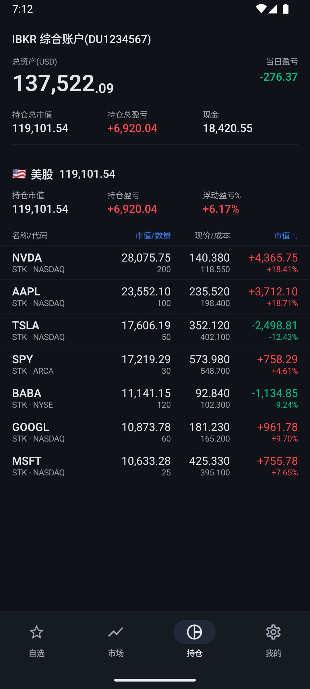
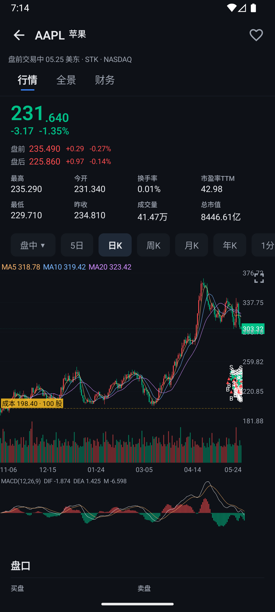
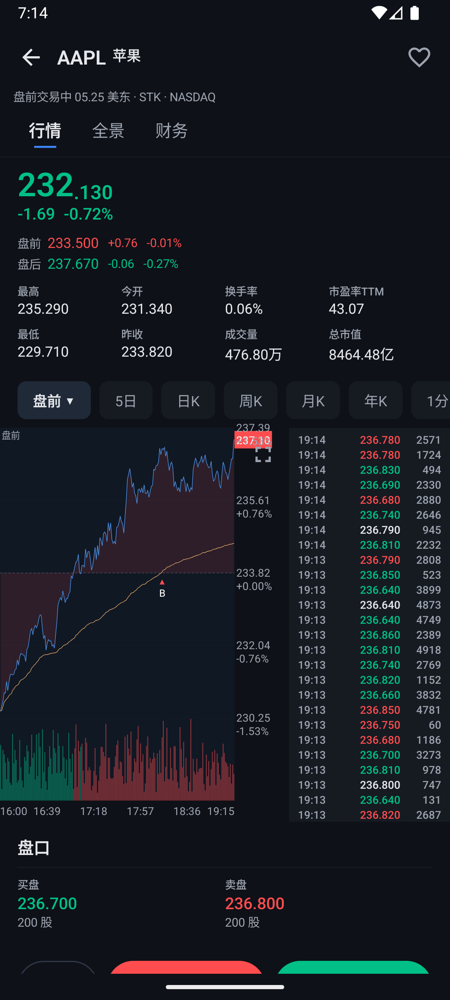
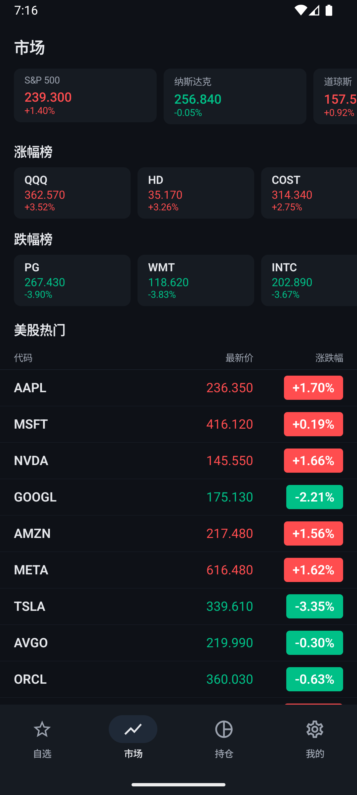
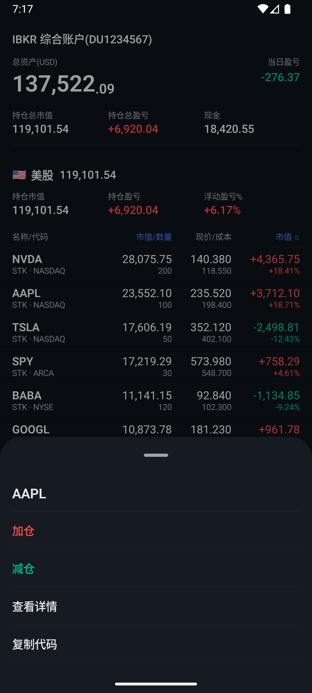
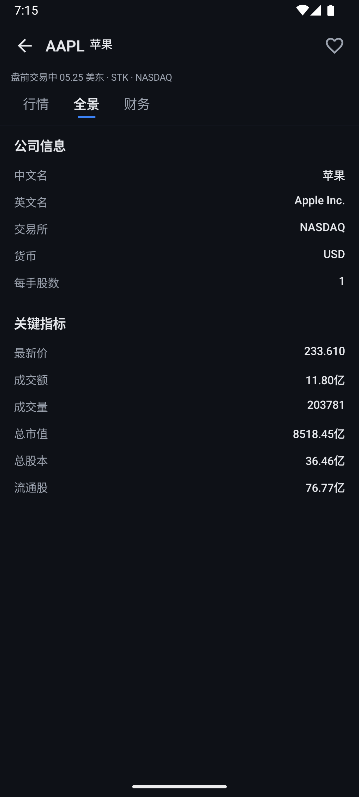
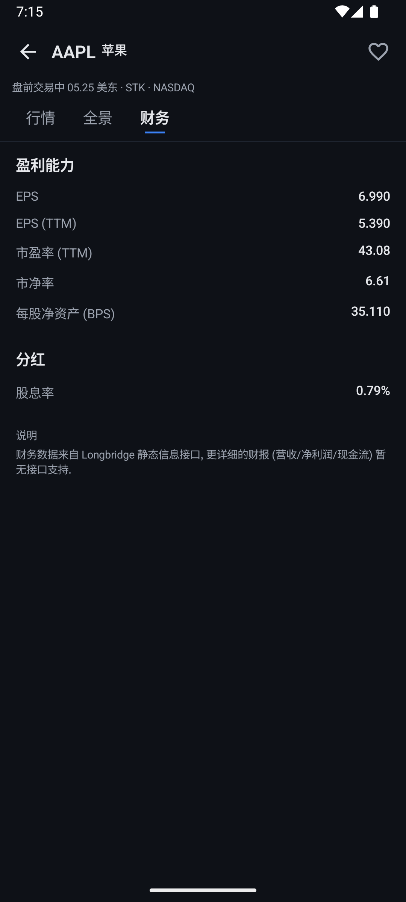
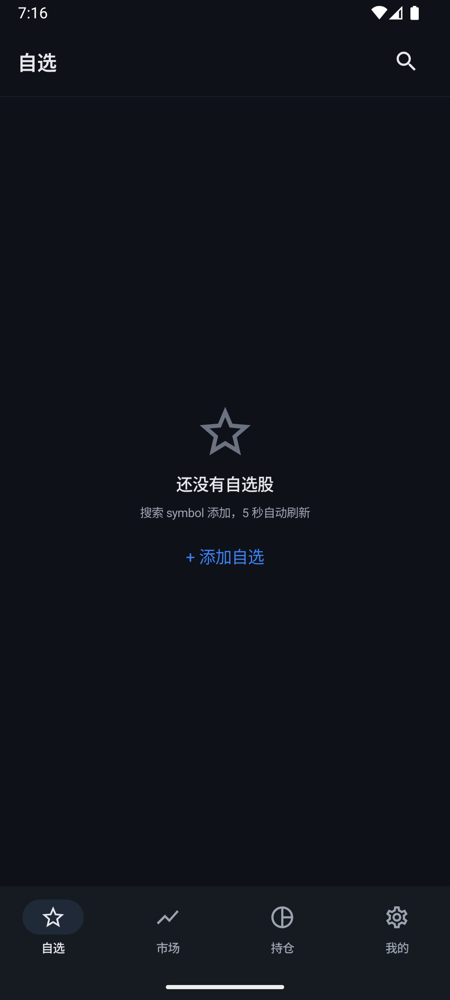

# ibkr-mobile

> A personal Android trading client for Interactive Brokers, with UI inspired by Longbridge / 长桥证券.

[](https://opensource.org/licenses/MIT)
[](https://kotlinlang.org/)
[](https://developer.android.com/jetpack/compose)
[](https://fastapi.tiangolo.com/)
[](https://github.com/ib-api-reloaded/ib_async)

Built because the official IBKR mobile app is slow, ugly, and missing the things a Longbridge user takes for granted: snappy K-lines with crosshair, intraday session classification (盘前 / 盘中 / 盘后 / 夜盘), red-up / green-down (红涨绿跌), aggregated positions PnL, one-tap quick-actions on long-press, and a UI that doesn't look like it was designed in 2008.

> **⚠️ Disclaimer**
> This is a personal project for educational purposes. It is **not** financial advice, **not** affiliated with Interactive Brokers or Longbridge, and is provided **as-is** with no warranty. Trading involves substantial risk of loss. Use a paper account first. You are solely responsible for any orders submitted through this software.

---

## Screenshots

<p align="center">
  
  
  
  
</p>

<p align="center">
  <em>From left: Positions with aggregated PnL · K-line with MA/MACD/cost basis · Intraday with VWAP and pre/regular/post/overnight session coloring · Market overview with movers</em>
</p>

<details>
<summary>More screenshots</summary>

<p align="center">
  
  
  
  
</p>

<p align="center">
  <em>Long-press quick actions · Company panorama · Financials · Watchlist empty state</em>
</p>

</details>

All screenshots are from the bundled **mock mode** running against a freshly-built emulator — no real account is needed to see the app like this. See [Quickstart](#quickstart) below.

---

## Try it in 60 seconds (mock mode)

Don't have an IBKR or LongPort account and just want to look around?

```bash
git clone https://github.com/whtis/ibkr-mobile.git
cd ibkr-mobile/backend
cp .env.example .env
echo "MOCK_MODE=yes" >> .env          # one line is the only required change
echo "API_TOKEN=anything-you-want" >> .env
uv sync
uv run uvicorn app.main:app --host 0.0.0.0 --port 8000
```

Then in another shell:

```bash
cd ibkr-mobile/android
./gradlew assembleDebug
adb install -r app/build/outputs/apk/debug/app-debug.apk
```

Open the app → Settings → backend URL `http://10.0.2.2:8000` (emulator) or `http://<your-LAN-ip>:8000` (real device), token = whatever you put in `.env` → save. Done. Mock mode serves a synthesized portfolio of AAPL, TSLA, NVDA, MSFT, GOOGL, BABA, SPY with realistic K-lines, intraday charts, and option chains.

---

## Architecture

```
┌─────────────────────────────────────────┐
│  Android App (Kotlin + Jetpack Compose) │
│  - Material 3, Canvas charts            │
│  - WebSocket realtime quotes            │
└──────────────────┬──────────────────────┘
                   │  HTTPS + Bearer token
                   │  (LAN Wi-Fi, Tailscale, or public TLS)
┌──────────────────▼──────────────────────┐
│  FastAPI + ib_async                     │
│  - REST + WebSocket                     │
│  - SQLite (execution history)           │
│  - LongPort SDK (free L1 quotes)        │
└──────────────────┬──────────────────────┘
                   │  TWS binary socket :4002 (paper) / :4001 (live)
┌──────────────────▼──────────────────────┐
│  IB Gateway in Docker (gnzsnz image)    │
└──────────────────┬──────────────────────┘
                   │
                   ▼
              IBKR servers
```

**The backend is the only place that holds IBKR credentials.** The Android app authenticates via a bearer token, configurable in Settings. No credentials, accounts, or executions ever live on the phone outside of an OS-protected `DataStore`.

---

## Features

### 📈 Market
- **Watchlist** with auto-refresh and pull-to-update
- **Search** by symbol with debounced lookup
- **Stock detail** page with three sub-tabs (行情 / 全景 / 财务):
  - Native Canvas K-line chart (`1m / 5m / 15m / 30m / 60m / 1d / 1w / 1mo`) with crosshair, zoom, pan
  - Intraday chart with 4-channel session classification (pre-market / regular / after-hours / overnight)
  - MACD sub-chart with linked crosshair
  - Company info + key metrics (P/E TTM, P/B, EPS, BPS, dividend yield)
- **Fullscreen chart** mode (landscape lock + larger viewport)
- **Option chain** browser with strike grid and side/expiry selector

### 💼 Positions
- Aggregated PnL across positions (more accurate than IBKR per-account summary)
- Four sort modes: market value / unrealized PnL / daily PnL / symbol
- Long-press quick actions: 加仓 / 减仓 / 查看详情 / 复制代码
- Active orders panel with one-tap cancel

### 🛒 Orders
- Market / Limit / Stop / Stop-Limit
- TIF: DAY / GTC / IOC / FOK
- RTH-only toggle
- Stocks + Options (with expiry / strike / right pre-filled from option chain)
- Live preview of margin impact

### ⚡ Realtime
- Single WebSocket multiplex with ref-counted subscriptions
- Auto-reconnect with exponential backoff
- LongPort L1 stream (free, real-time) + IBKR fallback

### 🎨 Polish
- 红涨绿跌 (Chinese convention: red = up, green = down)
- Material 3 dark theme tuned to Longbridge palette
- Adaptive icon (animated `C` pulse)
- Bottom-bar navigation, 4 tabs (自选 / 行情 / 持仓 / 设置)

---

## Tech stack

**Backend (`backend/`)**
- FastAPI, Uvicorn, Pydantic v2
- [`ib_async`](https://github.com/ib-api-reloaded/ib_async) 2.1.0 — modern async IBKR API client
- [`longport`](https://open.longportapp.com/) Python SDK 3.0.23 — free L1 quotes + K-lines
- SQLite for execution history persistence
- `uv` for dependency management
- Docker Compose + [`gnzsnz/ib-gateway`](https://github.com/gnzsnz/ib-gateway-docker)

**Android (`android/`)**
- Kotlin 2.1.20, Jetpack Compose BOM 2026.05.01
- Material 3
- Navigation Compose 2.9.8
- Ktor + OkHttp engine (HTTP + WebSocket)
- DataStore (settings persistence)
- kotlinx.serialization (JSON)
- Compose Canvas (native charts — no WebView)
- AGP 8.10.1 / Gradle 8.13 / minSdk 26 / compileSdk 36

---

## Quickstart

### 1. Backend

```bash
cd backend
cp .env.example .env

# edit .env — at minimum:
#   TWS_USERID=<your IBKR paper-trading username>
#   TWS_PASSWORD=<your IBKR paper-trading password>
#   API_TOKEN=$(openssl rand -hex 32)
#   LONGPORT_APP_KEY / SECRET / ACCESS_TOKEN — optional, but recommended for free quotes
#     (get at https://open.longportapp.com → Developer Center → Create App)
#
# OR: skip the IBKR + LongPort fields entirely and set MOCK_MODE=yes for synthetic data.
# See "Try it in 60 seconds" above.

# pull and start IB Gateway (Docker)
docker compose pull
docker compose up -d

# wait ~30s, watch Gateway login
docker compose logs -f ibgateway     # look for "API server listening on port 4002"

# install Python deps (first time only)
uv sync

# run FastAPI
uv run uvicorn app.main:app --host 0.0.0.0 --port 8000 --reload
```

Verify:

```bash
TOKEN=$(grep ^API_TOKEN .env | cut -d= -f2)
curl -s http://localhost:8000/health | jq                  # ib_connected: true
curl -s -H "Authorization: Bearer $TOKEN" \
  http://localhost:8000/account/positions | jq
```

See [`backend/README.md`](backend/README.md) for the full smoke-test set and troubleshooting.

### 2. Android

```bash
cd android
./gradlew assembleDebug
# APK at: app/build/outputs/apk/debug/app-debug.apk
```

Install on device:

```bash
adb install -r app/build/outputs/apk/debug/app-debug.apk
```

Open the app → **Settings** tab → fill in:
- **Backend URL**: `http://<Mac LAN IP>:8000` (or `https://your.domain` if cloud-hosted)
- **API Token**: same value as `API_TOKEN` in backend `.env`
- Tap **测试连接** → should turn green
- Tap **保存**

Now the Positions / Market / Watchlist tabs will populate from your paper account.

### 3. (Optional) Cloud deployment

Quote-only deployments (LongPort quotes without IBKR trading) can run on any small VPS — no Mac required for the Gateway:

```bash
# on your server
git clone <this repo>
cd ibkr-mobile/backend
cp .env.example .env
# fill LONGPORT_* keys, leave TWS_* blank or set READ_ONLY_API=yes
uv sync
# put behind nginx + Let's Encrypt + systemd, point your domain at it
```

Full IBKR trading needs IB Gateway, which has stricter networking + 2FA requirements. The Mac-as-gateway model is recommended for the trading path; the VPS can serve as a public quote endpoint.

---

## Project layout

```
ibkr-mobile/
├── android/                   Kotlin + Compose app
│   ├── app/src/main/
│   │   ├── java/com/tis/ibkr/
│   │   │   ├── data/          API client, DataStore, models
│   │   │   ├── ui/screens/    Watchlist, Market, Positions, StockDetail, ...
│   │   │   ├── ui/components/ Charts, sub-bars, quick-action sheet
│   │   │   ├── ui/theme/      Longbridge-inspired Material 3 theme
│   │   │   └── viewmodel/     One ViewModel per screen
│   │   └── res/               icons (adaptive), strings
│   └── gradle/libs.versions.toml
├── backend/                   FastAPI + ib_async
│   ├── app/
│   │   ├── main.py            FastAPI app, lifespan, CORS
│   │   ├── ibkr.py            IB Gateway connector
│   │   ├── longbridge.py      LongPort SDK wrapper
│   │   ├── db.py              SQLite executions store
│   │   ├── auth.py            Bearer auth dependency
│   │   └── routes/
│   │       ├── account.py     summary, positions
│   │       ├── orders.py      place, cancel, list active
│   │       ├── executions.py  history (SQLite + ib_async)
│   │       ├── options.py     option chain, contract lookup
│   │       ├── quote.py       quote, intraday, bars (K-line)
│   │       └── ws_quotes.py   WebSocket realtime stream
│   ├── docker-compose.yml     IB Gateway container
│   └── pyproject.toml
├── BUILD.md                   Architecture decisions
├── DESIGN_NOTES.md            UI/UX spec referencing Longbridge
├── ONBOARDING.md              Setup gotchas (IBKR auth quirks, etc.)
└── README.md                  ← you are here
```

---

## Why these choices

| Decision | Reason |
|---|---|
| **Compose Canvas charts (not WebView)** | First paint ~50 ms vs ~800 ms for a WebView+JS chart lib. Memory ~5 MB vs ~50 MB. |
| **LongPort SDK + IBKR fallback** | LongPort gives free real-time L1 + K-lines for US + HK + CN; IBKR market data is paid. Trading still goes through IBKR. |
| **ib_async over ibapi/ib-insync** | `ib-insync` is no longer maintained; `ib_async` is its modern fork, native async, type-hinted. |
| **`gnzsnz/ib-gateway` in Docker** | Headless IB Gateway with IBC auto-login, VNC for debugging, daily restart. Avoids manual Gateway baby-sitting. |
| **One Mac as the gateway host** | Gateway needs persistent network identity + 2FA approval. A always-on Mac is simpler than fighting Docker NAT + cloud IP rotation. |
| **WebSocket subscription multiplex with refcounts** | Multiple Compose screens can subscribe to the same symbol cheaply; cleanup is automatic when the last subscriber leaves. |
| **SQLite execution history** | IBKR `reqExecutions` only returns 7 days. Local persistence preserves full history. |
| **`uv` over `pip`** | ~10× faster install, lockfile, pyproject-native. |

---

## Documentation

- [`ROADMAP.md`](ROADMAP.md) — v2 plan: multi-user, Longbridge SDK in-app, dynamic Gateway lifecycle
- [`BUILD.md`](BUILD.md) — architecture, topology, decisions
- [`DESIGN_NOTES.md`](DESIGN_NOTES.md) — Longbridge UI spec, screen-by-screen
- [`ONBOARDING.md`](ONBOARDING.md) — IBKR auth gotchas + Android/Gradle troubleshooting
- [`backend/README.md`](backend/README.md) — backend setup + smoke tests
- [`openspec/changes/multi-user-v2/`](openspec/changes/multi-user-v2/) — v2 detailed spec (proposal, design, tasks)

---

## Status

- **v1**: shipped, in personal daily use. Single-user, paper account.
- **v2**: design complete, implementation pending — see [`ROADMAP.md`](ROADMAP.md). Adds per-device multi-user, moves Longbridge SDK in-app, makes the backend credential-free.

Active development. APIs and screens may change without notice.

Tested with: Pixel-class Android devices and emulators, IBKR paper account, LongPort developer account.

---

## Contributing

PRs are welcome, especially ones aligned with [`ROADMAP.md`](ROADMAP.md). For anything non-trivial, please open an issue first so we can discuss direction before you write the code.

See [`CONTRIBUTING.md`](CONTRIBUTING.md) for dev setup, code style, what kinds of PRs are most likely to land, and what to avoid. Note that **mock mode** (described in Quickstart above) lets you contribute without any brokerage credentials — start there.

Looking for somewhere to start? Check the [`good first issue`](https://github.com/whtis/ibkr-mobile/issues?q=is%3Aissue+is%3Aopen+label%3A%22good+first+issue%22) and [`help wanted`](https://github.com/whtis/ibkr-mobile/issues?q=is%3Aissue+is%3Aopen+label%3A%22help+wanted%22) labels.

This project follows a [Code of Conduct](CODE_OF_CONDUCT.md).

---

## License

MIT. See [`LICENSE`](LICENSE).

**The MIT license grants you broad rights, but it does not grant you a right to safety.** Read the disclaimer above. Trade with money you can afford to lose.

---

Built by [@whtis](https://github.com/whtis). Contributions from anyone who finds it useful.
