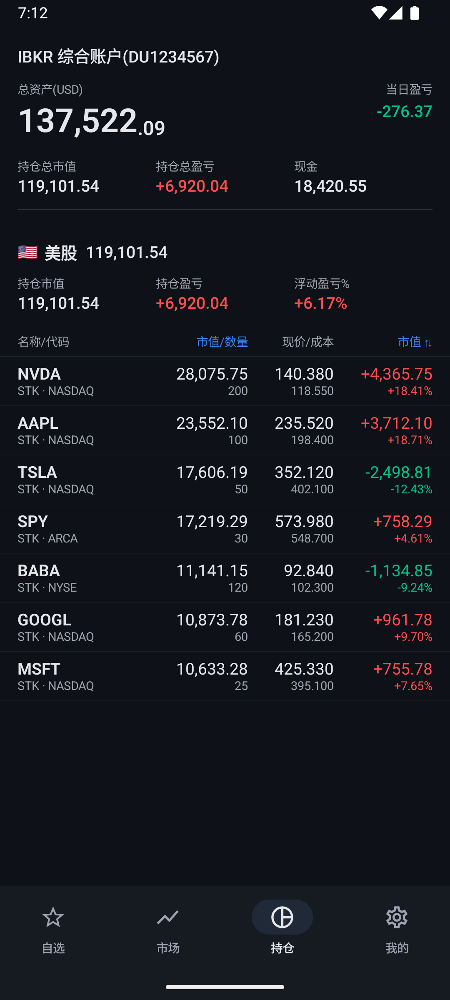
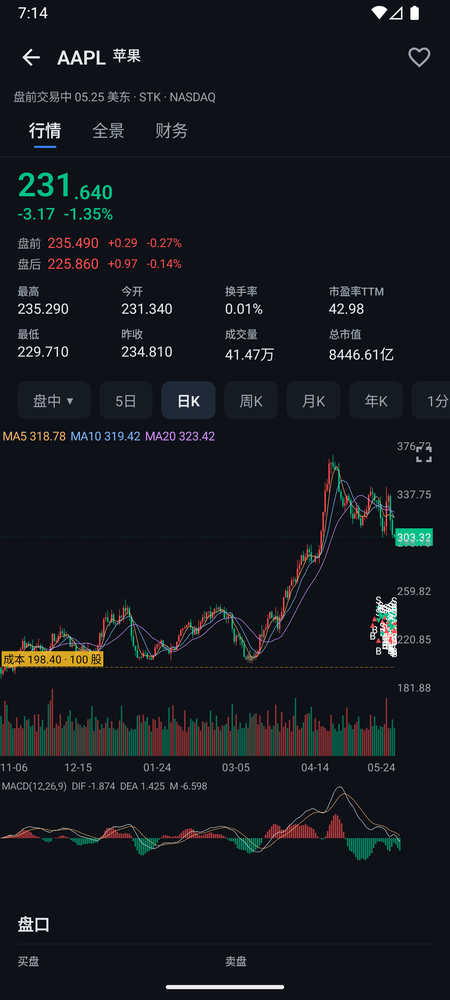
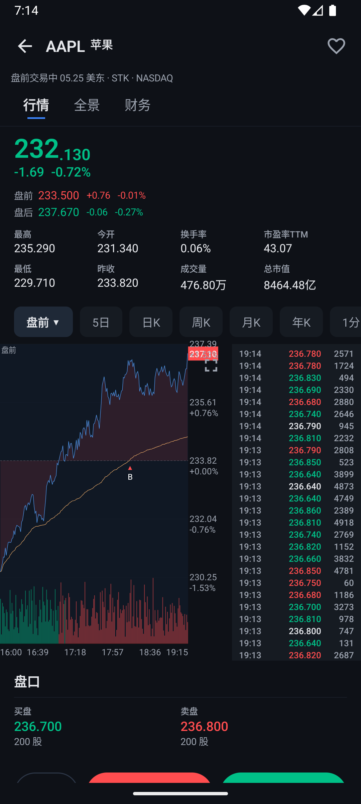
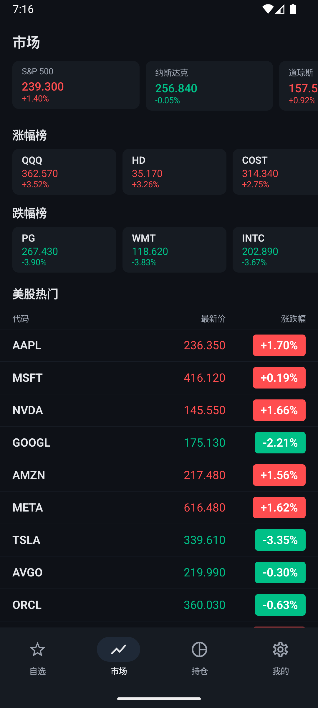

# ibkr-mobile

> 自用的 Interactive Brokers Android 交易客户端，UI 参考长桥证券 / Longbridge。

[](https://opensource.org/licenses/MIT)
[](https://kotlinlang.org/)
[](https://developer.android.com/jetpack/compose)
[](https://fastapi.tiangolo.com/)
[](https://github.com/ib-api-reloaded/ib_async)

**[English](README.md) · [中文](README.zh-CN.md)**

写这套是因为 IBKR 官方 App 又慢又难看，少了长桥用户习以为常的功能：丝滑带十字光标的 K 线、四段日内分时（盘前 / 盘中 / 盘后 / 夜盘）、红涨绿跌、聚合持仓盈亏、长按一键操作，以及一套不像 2008 年设计的界面。

> **⚠️ 免责声明**
> 个人学习项目。**不构成**投资建议，**与** Interactive Brokers 或长桥证券**无任何关联**，按 **"as-is"** 提供，无任何担保。交易有重大本金亏损风险。先用模拟账户。通过本软件提交的任何订单后果由你自行承担。

---

## 截图

<p align="center">
  
  
  
  
</p>

<p align="center">
  <em>从左到右：聚合盈亏持仓 · MA/MACD/成本线 K 线 · VWAP + 盘前/盘中/盘后/夜盘四色分时 · 市场涨跌榜</em>
</p>

所有截图均来自内置的 **mock 模式**（在新建模拟器里跑），**不需要任何真实账户**就能看到这种效果。见下方 [60 秒上手](#60-秒上手mock-模式)。

---

## 60 秒上手（mock 模式）

没有 IBKR 或长桥账号、只想先看看？

```bash
git clone https://github.com/whtis/ibkr-mobile.git
cd ibkr-mobile/backend
cp .env.example .env
echo "MOCK_MODE=yes" >> .env          # 唯一必改的一行
echo "API_TOKEN=anything-you-want" >> .env
uv sync
uv run uvicorn app.main:app --host 0.0.0.0 --port 8000
```

另一个终端：

```bash
cd ibkr-mobile/android
./gradlew assembleDebug
adb install -r app/build/outputs/apk/debug/app-debug.apk
```

打开 App → 我的（Settings） → 后端 URL 填 `http://10.0.2.2:8000`（模拟器）或 `http://<局域网 IP>:8000`（真机），token 填 `.env` 里那串 → 保存。完事。Mock 模式会喂出一份合成的 AAPL / TSLA / NVDA / MSFT / GOOGL / BABA / SPY 组合，K 线、分时、期权链都是逼真的伪造数据。

---

## 架构

```
┌─────────────────────────────────────────┐
│  Android App（Kotlin + Jetpack Compose）│
│  - Material 3、Canvas 图表               │
│  - WebSocket 实时行情                    │
└──────────────────┬──────────────────────┘
                   │  HTTPS
                   │  X-Timestamp + X-Signature + X-Device-ID
                   │  (HMAC-SHA256，密钥存于 AndroidKeyStore TEE/StrongBox)
┌──────────────────▼──────────────────────┐
│  FastAPI + ib_async                     │
│  - REST + WebSocket                     │
│  - HMAC 验证（devices 表）              │
│  - SQLite（成交流水 + 已配对设备）        │
│  - LongPort SDK（免费 L1 行情）         │
└──────────────────┬──────────────────────┘
                   │  TWS 二进制 socket :4002（paper） / :4001（live）
┌──────────────────▼──────────────────────┐
│  IB Gateway in Docker（gnzsnz 镜像）    │
└──────────────────┬──────────────────────┘
                   │
                   ▼
              IBKR 服务器
```

**IBKR 凭据只存在于后端。** Android App 用 HMAC-SHA256 请求签名鉴权，签名密钥永远不离开手机的 AndroidKeyStore（TEE / StrongBox），App 层只能调用系统接口让 Keystore 替你签一次。静态 bearer token **只**在一次性配对时用一次；之后所有请求都带 `X-Timestamp` + `X-Signature`（+ 可选 `X-Device-ID`），轮换 token 完全不影响已配对设备。详见下方 [鉴权](#鉴权)。

---

## 鉴权

两条路径：

### 1. 配对 —— 一次性，用 Bearer token

```
手机                                                 后端
  │                                                    │
  │── POST /devices/pair                               │
  │    Authorization: Bearer <api_token>               │
  │                                                    │── 生成 32 字节 HMAC 密钥 K
  │                                                    │── INSERT INTO devices (id, K, label)
  │                                                    │
  │<── { device_id, hmac_key_hex }                     │
  │                                                    │
  │── KeystoreHmac.importKey(K)                        │
  │    K 进入 TEE / StrongBox 后封死，                  │
  │    App 永远拿不回 K 的字节，                        │
  │    只能调 Mac.sign() 让系统替自己签                 │
```

配对结束后，立刻去后端 `backend/.env` 把 `API_TOKEN` 重新生成一次。已配对设备**完全不受影响** —— 它们用 K 签名，跟 token 没关系。

### 2. 普通请求 —— 配对之后每次调用

```
canonical = METHOD + "\n" + PATH_AND_QUERY + "\n" + TIMESTAMP_MS + "\n" + sha256_hex(body)
signature = HMAC_SHA256(K, canonical)

X-Timestamp: 1717933200000
X-Signature: ab12cd34...
X-Device-ID: a54e703c4d3b479b   （可选；带上能让后端跳过遍历）
```

后端 (`backend/app/auth.py::require_signature`) 通过条件：

- `X-Timestamp` 在服务器时间 ±60 秒内
- 用某一台已配对设备的 K 重算，签名一致
- 这个签名在过去 60 秒内**没见过**（进程内 nonce 缓存防重放）

所有失败统一回 `401 auth failed`，不区分原因 —— 不给攻击者侧信道。真实原因写在服务端日志。

### 威胁模型

| 攻击场景                                      | 我们的防御                                         | 结果 |
|---|---|---|
| Token 截图发群 / 误提交到仓库                 | Token 不能直接读数据，只能配对                     | 攻击者只能配一台对抗设备 —— 在你的 `/devices` 列表里看得到，可吊销 |
| APK 被反编译                                  | K 在 Keystore 不在代码里                           | 反编译看不到 K；攻击者在自己手机重装 APK 配对得到的是另一把 K，后端不认 |
| 单条 HTTPS 请求被截获（中间人 + 装证书）       | timestamp 窗口 + nonce 缓存                        | 60 秒内 nonce 命中拒；60 秒后 timestamp 过期拒 |
| 长期 MITM，想自己造新请求                      | HMAC 密钥从未离开手机                              | 没 K 算不出新 `HMAC(K, new_canonical)` |
| 手机被偷且屏幕已解锁                          | 不在软件方案的能力范围内                           | 上锁屏 PIN / 生物认证 / 远程擦除 |

这套是工业标准 —— AWS SigV4、Google Cloud Storage 鉴权请求、Stripe webhook 签名，全是这一套：HMAC + 规范字符串 + 时间戳 + nonce。这里独特的部分是把 K 关在 AndroidKeyStore 里，让"APK 被偷、DataStore 被 dump"都拿不到 K。

---

## 功能

### 📈 行情
- **自选** 自动刷新 + 下拉手动刷
- **搜索** 输代码模糊匹配（含中文公司名 → 600519 茅台 之类）
- **个股详情**三个 sub-tab（行情 / 全景 / 财务）：
  - 原生 Canvas K 线（`1m / 5m / 15m / 30m / 60m / 1d / 1w / 1mo`），带十字光标、缩放、平移
  - 四段时段着色（盘前 / 盘中 / 盘后 / 夜盘）的分时图
  - 联动十字光标的 MACD 副图
  - 公司基本信息 + 关键指标（P/E TTM、P/B、EPS、BPS、股息率）
- **横屏全屏图**（强制横屏 + 大视口）
- **期权链**浏览器，行权价网格 + 看涨/看跌 + 到期选择

### 💼 持仓
- **多账户切换** — 在持仓页选择关联的不同账户
- 跨持仓聚合盈亏（比 IBKR 自带的按账户聚合更准）
- 四种排序：市值 / 浮盈 / 当日盈亏 / 代码
- 长按一键：加仓 / 减仓 / 查看详情 / 复制代码
- 当前活跃委托面板，一键撤单

### 🛒 下单
- 市价 / 限价 / 止损 / 止损限价
- 有效期：DAY / GTC / IOC / FOK
- 仅盘中 / 盘中+盘前盘后 切换
- 股票 + 期权（行权价 / 到期日 / 看涨看跌从期权链带过来）
- 实时预览保证金影响
- **实盘账户** 触发红色二次确认 Dialog；模拟账户直接提交

### ⚡ 实时
- 单一 WebSocket 多路复用 + 引用计数订阅
- 自动重连指数退避
- LongPort L1 流（免费、实时）+ IBKR 回退

### 🎨 细节
- 红涨绿跌（A 股 / 港股习惯，可在设置里切换）
- Material 3 暗色主题，调成长桥风格
- 自适应图标（`C` 字动画脉冲）
- 底部导航 4 个 tab（自选 / 行情 / 持仓 / 我的）

### 🔔 更新与提醒
- **应用内更新** — 启动时和设置页检查 GitHub release，直接在 App 内下载并安装新 APK
- **网关 2FA 推送** — 网关每周冷启动需要二次验证时,手机收到通知（FCM）。后端读网关日志检测,经 Cloudflare Worker 中转发送,所以后端在墙内也能推

---

## 技术栈

**后端（`backend/`）**
- FastAPI、Uvicorn、Pydantic v2
- [`ib_async`](https://github.com/ib-api-reloaded/ib_async) 2.1.0 —— 现代 async IBKR 客户端
- [`longport`](https://open.longportapp.com/) Python SDK 2.x —— 免费 L1 行情 + K 线
- SQLite 存历史成交 + 已配对设备
- `uv` 管依赖
- Docker Compose + [`gnzsnz/ib-gateway`](https://github.com/gnzsnz/ib-gateway-docker)

**Android（`android/`）**
- Kotlin 2.1.20、Jetpack Compose BOM 2026.05.01
- Material 3
- Navigation Compose 2.9.8
- Ktor + OkHttp 引擎（HTTP + WebSocket）
- AndroidKeyStore（HMAC 签名密钥硬件级保护）
- DataStore（设置持久化）
- kotlinx.serialization（JSON）
- Compose Canvas 原生绘图（**不用** WebView）
- AGP 8.10.1 / Gradle 8.13 / minSdk 26 / compileSdk 36

---

## 完整上手

### 1. 后端

```bash
cd backend
cp .env.example .env

# 改 .env，至少要填：
#   TWS_USERID=<你的 IBKR paper 账号>
#   TWS_PASSWORD=<你的 IBKR paper 密码>
#   API_TOKEN=$(openssl rand -hex 32)
#   LONGPORT_APP_KEY / SECRET / ACCESS_TOKEN —— 可选，但推荐填（免费 L1 行情）
#     去 https://open.longportapp.com → 开发者中心 → 创建应用
#
# 或者：跳过 IBKR + LongPort 全部字段，把 MOCK_MODE=yes 打开用合成数据。
# 见上面的"60 秒上手"。

# 拉镜像、起 IB Gateway
docker compose pull
docker compose up -d

# 等 ~30s 看 Gateway 登录
docker compose logs -f ibgateway     # 找 "API server listening on port 4002"

# 装 Python 依赖（首次）
uv sync

# 跑 FastAPI
uv run uvicorn app.main:app --host 0.0.0.0 --port 8000 --reload
```

验证：

```bash
TOKEN=$(grep ^API_TOKEN .env | cut -d= -f2)
curl -s http://localhost:8000/health | jq                  # ib_connected: true
# 注意：除 /health 外，其它端点配对完之后只接受 HMAC 签名。Bearer token
# 单独直接调 /account/* 会被 401。模拟 token 鉴权见 backend/README.md
```

完整 smoke test + 排错见 [`backend/README.md`](backend/README.md)。

### 2. Android

```bash
cd android
./gradlew assembleDebug
# APK 路径：app/build/outputs/apk/debug/app-debug.apk
```

装到设备：

```bash
adb install -r app/build/outputs/apk/debug/app-debug.apk
```

打开 App → **我的** tab → 填：
- **Backend URL**: `http://<局域网 IP>:8000`（或部署到云上的 `https://your.domain`）
- **API Token**: 跟后端 `.env` 里的 `API_TOKEN` 一致
- 点 **测试连接** → 应该绿
- 点 **保存**

往下翻到 **设备配对**，点 **配对此设备**：

- App 用 bearer token 调一次 `POST /devices/pair`
- 后端返回的 HMAC 密钥**直接导入 AndroidKeyStore**（硬件级 TEE / StrongBox 保护）
- 之后所有请求自动用这把密钥签名；token 不再被使用
- **建议**：立刻回后端把 `.env` 里的 `API_TOKEN` 轮换一次并重启后端，让"刚才配对用过的那 token"彻底失效。已配对设备**完全不受影响**

现在自选 / 行情 / 持仓 tab 就能拉到你 paper 账户的数据了。

### 3.（可选）部署到云

只跑行情服务（LongPort 行情，不接 IBKR 交易）可以放到任意小 VPS 上，不需要持续在线的 Mac：

```bash
# 在你的服务器上
git clone <本仓库>
cd ibkr-mobile/backend
cp .env.example .env
# 填 LONGPORT_*，TWS_* 留空或设 READ_ONLY_API=yes
uv sync
# 放 nginx + Let's Encrypt + systemd 后面，绑域名
```

完整 IBKR 交易需要 IB Gateway，对网络 + 2FA 都更挑剔，推荐的拓扑还是"一台常开的 Mac/NAS 当 Gateway 宿主"，VPS 当对外行情口子。

---

## 仓库结构

```
ibkr-mobile/
├── android/                   Kotlin + Compose App
│   ├── app/src/main/
│   │   ├── java/com/tis/ibkr/
│   │   │   ├── data/          API 客户端、DataStore、模型、
│   │   │   │                  KeystoreHmac（TEE 级 HMAC 包装）、
│   │   │   │                  RequestSigning（Ktor 签名插件）
│   │   │   ├── ui/screens/    自选 / 行情 / 持仓 / 个股 / ...
│   │   │   ├── ui/components/ 图表、子栏、长按浮层
│   │   │   ├── ui/theme/      长桥风格 Material 3 主题
│   │   │   └── viewmodel/     每屏一个 ViewModel
│   │   └── res/               图标（自适应）、字符串
│   └── gradle/libs.versions.toml
├── backend/                   FastAPI + ib_async
│   ├── app/
│   │   ├── main.py            FastAPI app、lifespan、CORS
│   │   ├── ibkr.py            IB Gateway 连接器
│   │   ├── longbridge.py      LongPort SDK 包装
│   │   ├── db.py              SQLite 成交 + 已配对设备
│   │   ├── auth.py            Bearer（仅配对）+ HMAC 签名
│   │   └── routes/
│   │       ├── account.py     account summary、持仓
│   │       ├── devices.py     配对 / 列出 / 吊销（签名鉴权）
│   │       ├── orders.py      下单、撤单、活跃订单
│   │       ├── executions.py  历史成交（SQLite + ib_async）
│   │       ├── options.py     期权链、合约查询
│   │       ├── quote.py       行情、分时、K 线
│   │       └── ws_quotes.py   WebSocket 实时流
│   ├── docker-compose.yml     IB Gateway 容器
│   └── pyproject.toml
├── BUILD.md                   架构决策
├── DESIGN_NOTES.md            UI/UX 规范（参考长桥）
├── ONBOARDING.md              踩坑记（IBKR 认证、构建问题）
└── README.md                  ← 你在这（英文）
└── README.zh-CN.md            ← 中文版
```

---

## 为什么这么选

| 决策 | 原因 |
|---|---|
| **Compose Canvas 画图（不用 WebView）** | 首屏 ~50ms vs WebView+JS 库 ~800ms。内存 ~5MB vs ~50MB。 |
| **LongPort SDK + IBKR 兜底** | LongPort 美股/港股/A股免费实时 L1 + K 线；IBKR 行情要付费。下单还走 IBKR。 |
| **ib_async（而非 ibapi/ib-insync）** | `ib-insync` 已停更；`ib_async` 是现代 fork，原生 async，有类型。 |
| **`gnzsnz/ib-gateway` 装 Docker 里** | 无头 IB Gateway + IBC 自动登录 + VNC 调试口 + 每日重启。比手动管 Gateway 省心。 |
| **一台常开的宿主跑 Gateway** | Gateway 需要稳定网络身份 + 2FA 处理，常开机器比跟 Docker NAT / 云端 IP 漂移作斗争简单。 |
| **WebSocket 多路复用 + 引用计数** | 多个 Compose 屏可廉价订阅同一 symbol，最后一个 subscriber 离开时自动清理。 |
| **SQLite 存成交历史** | IBKR `reqExecutions` 只返 7 天，本地持久化保留完整记录。 |
| **`uv` 替代 `pip`** | ~10× 装得快、lockfile、pyproject 原生。 |
| **HMAC + AndroidKeyStore 鉴权** | 单独泄露 token 无法读数据 —— 只能配对。APK 反编译也拿不到签名密钥（在 TEE / StrongBox 里）。重放攻击被 timestamp + nonce 锁在 60s 窗口内。跟 AWS SigV4 一个套路。 |

---

## 文档

- [`ROADMAP.md`](ROADMAP.md) —— v2 规划：多用户、Longbridge SDK 内嵌、动态 Gateway
- [`BUILD.md`](BUILD.md) —— 架构、拓扑、决策
- [`DESIGN_NOTES.md`](DESIGN_NOTES.md) —— 长桥 UI 规范，逐屏对照
- [`ONBOARDING.md`](ONBOARDING.md) —— IBKR 认证踩坑 + Android/Gradle 排错
- [`backend/README.md`](backend/README.md) —— 后端搭建 + smoke test
- [`openspec/changes/multi-user-v2/`](openspec/changes/multi-user-v2/) —— v2 详细规范

---

## 状态

- **v1**：已发布，自用日跑。单用户、paper 账户。HMAC + Keystore 鉴权已上线。
- **v2**：设计完成，开发未启动 —— 见 [`ROADMAP.md`](ROADMAP.md)。引入按设备的多用户、把 LongPort SDK 搬进 App、后端无凭据化。

积极开发中，API 和界面可能不预告就改。

测试环境：Pixel 级 Android 设备 + 模拟器、IBKR paper 账户、LongPort 开发者账户。

---

## 贡献

欢迎 PR，最好跟 [`ROADMAP.md`](ROADMAP.md) 一致。非琐事请先开 issue 讨论方向再写代码。

[`CONTRIBUTING.md`](CONTRIBUTING.md) 有开发环境搭建、代码风格、PR 优先级。**mock 模式**（见上面的快速上手）让你完全不用任何券商账号就能贡献 —— 从这里开始最稳。

找入门题？看 [`good first issue`](https://github.com/whtis/ibkr-mobile/issues?q=is%3Aissue+is%3Aopen+label%3A%22good+first+issue%22) 和 [`help wanted`](https://github.com/whtis/ibkr-mobile/issues?q=is%3Aissue+is%3Aopen+label%3A%22help+wanted%22) 标签。

本项目遵循 [Code of Conduct](CODE_OF_CONDUCT.md)。

---

## 许可证

MIT。见 [`LICENSE`](LICENSE)。

**MIT 给你的是用代码的权利，不是钱包的安全。** 读上面的免责声明。用你输得起的钱交易。

---

由 [@whtis](https://github.com/whtis) 起手。欢迎觉得有用的人加入。
